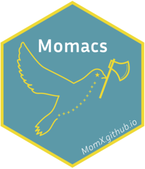

<!-- README.md is generated from README.Rmd. Please edit that file -->

```{r, include = FALSE}
knitr::opts_chunk$set(
  collapse = TRUE,
  comment = "#>",
  fig.path = "man/figures/README-",
  out.width = "100%"
)
```

# Momacs <a href="https://momx.github.io/Momacs/"></a>

 <!-- badges: start -->
   [](https://lifecycle.r-lib.org/articles/stages.html#experimental)
   [](https://CRAN.R-project.org/package=Momacs)
  [](https://github.com/MomX/Momacs/actions/workflows/R-CMD-check.yaml)
  <!-- badges: end -->

Interactive Shiny application for digitizing morphometric data from images.

Supports landmarks, polylines, polygons, curves, and outlines with export to JSON format.

## Installation

You can install the development version of Momacs from [GitHub](https://github.com/) with:

``` r
# install.packages("pak")
pak::pak("MomX/Momacs")
```

## Example

This is a basic example which shows you how to solve a common problem:

```{r example}
library(Momacs)
## basic example code
```
